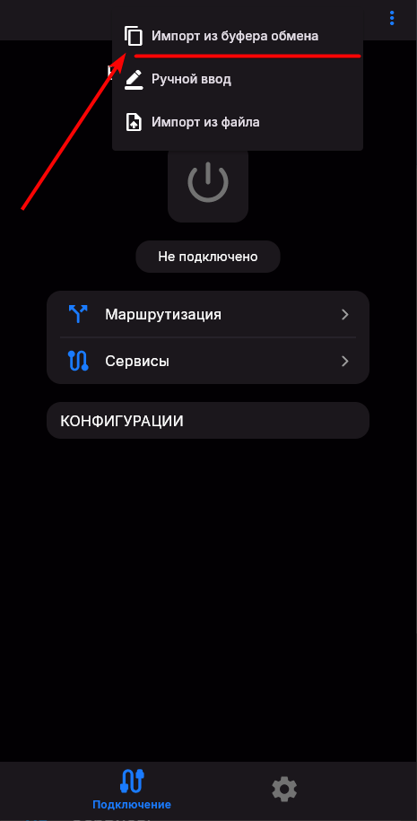

# О чём эта статья?

Здесь показано как вставить Vless ключ в различные VPN клиенты

# V2RayNG (Android)

Скачиваем и устанавливаем приложение: <https://en.v2rayng.org/download/>
Копируем ключ который начинается с `vless://` или `hy2://` из услуги или 3x-ui/marzban панелей и вставляем его в приложении.

# V2RayTun (iOS, MacOS)

Скачиваем и устанавливаем приложение: <https://apps.apple.com/kz/app/v2raytun/id6476628951>
Копируем Vless ключ который начинается с `vless://` из услуги или 3x-ui/marzban панелей:

Заходим в приложение и вставляем ключ из буфера обмена:

Далее жмём на кнопку включения:

# Throne (Windows, Linux)

## Ссылки для скачивания Throne

Вот список всех доступных ссылок для загрузки Throne, разделенных по операционным системам:

1. Throne для Windows (64-bit)
[Скачать](https://github.com/throneproj/Throne/releases/download/1.0.9/Throne-1.0.9-windows64-installer.exe)
Это версия для 64-битных систем Windows. Подходит для большинства современных компьютеров под управлением Windows 10 или 11.

2. Throne для Linux (64-bit, архив)
[Скачать](https://github.com/throneproj/Throne/releases/download/1.0.9/Throne-1.0.9-linux-amd64.zip)
Это архивная версия для пользователей Linux, которую необходимо распаковать перед использованием.

3. Throne для Debian/Ubuntu (64-bit, пакет .deb)
[Скачать](https://github.com/throneproj/Throne/releases/download/1.0.9/Throne-1.0.9-debian-x64.deb)
Это версия в формате .deb для систем на базе Debian и Ubuntu. Подходит для удобной установки через пакетный менеджер.

## Установка и настройка Throne на Windows

**Шаг 1: Загрузка Throne**

Для начала необходимо скачать программу по ссылке:

[Скачать Throne для Windows (64-bit)](https://github.com/throneproj/Throne/releases/download/1.0.9/Throne-1.0.9-windows64-installer.exe)

**Шаг 2: Установка программы**

После завершения загрузки выполните следующие действия:

1. Найдите загруженный файл Throne-1.0.9-windows64-installer.exe
2. Запустите его и установите его.

**Шаг 3: Запуск программы**

1. Откройте папку с распакованными файлами.
2. Найдите файл `Throne.exe`.
3. Дважды щелкните по нему, чтобы запустить программу.

Программа не требует отдельной установки и готова к использованию сразу после запуска. Однако потребуются некоторые дополнительные настройки для стабильной работы.

### Первичная настройка Throne на Windows

1. **Выбор ядра sing-box**:
При первом запуске обязательно выберите ядро **sing-box**. Это необходимо для корректной работы.

Если вы ранее устанавливали Throne и выбрали другое ядро, вам потребуется:

- Перейти в **Основные настройки**.
- Открыть раздел **Ядро**.
- Выбрать ядро **sing-box**.

2. Добавление ссылки на VPN:
Копируем ключ который начинается с `vless://` или `hy2://` из услуги или 3x-ui/marzban панелей:

- Вставьте её в Throne, используя сочетание клавиш **Ctrl + V** или через меню:
- - Нажмите на кнопку **Сервер**.
- - Выберите опцию **Добавить профиль из буфера обмена**.

3. **Активация режима TUN и запуск:**

- Активируйте **Режим TUN**.
- Запустите конфигурацию, нажав по конфигу правой кнопкой мыши и выбрав опцию **Запуск**.

Теперь **Throne** настроен и проксирует все соединения. Для удобства вы можете включить автозапуск **Throne**.

Для этого выполните следующие шаги:

1. Нажмите на кнопку **"Программа"**.
2. Установите галочки на двух пунктах:

- - **"Запускаться вместе с системой".**
- - **"Запомнить последний профиль".**

После этих действий **Throne** будет автоматически запускаться вместе с системой.

